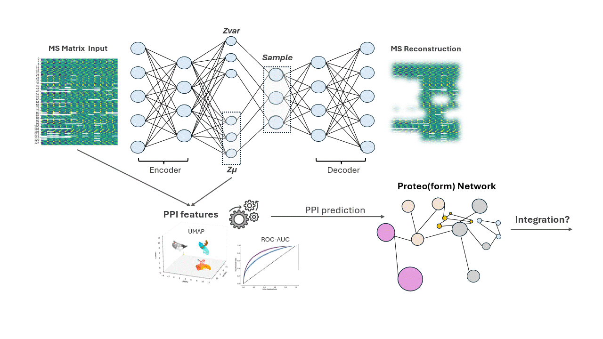
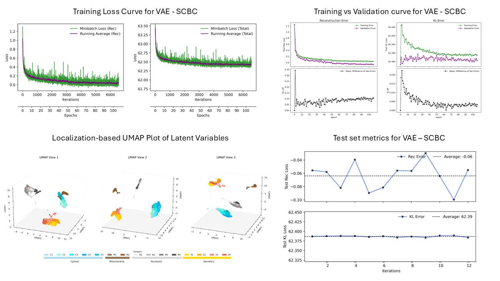
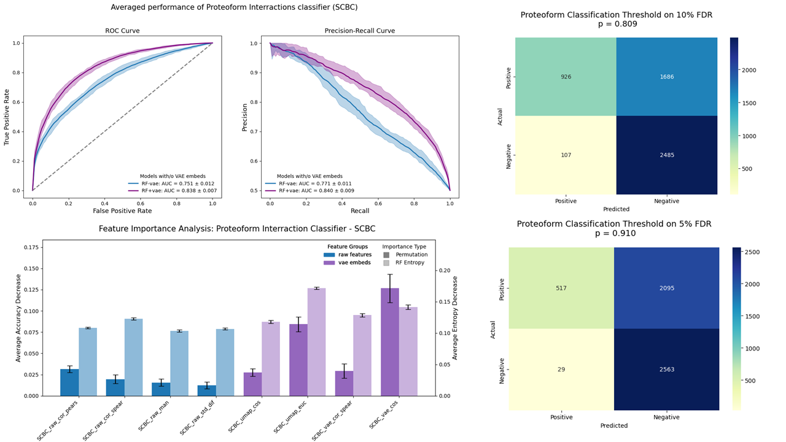

# Proteomics in the Latent Space 
This project is ongoing - it is updated from time to time 
## Table of Contents
* [Proteomics in the Latent Space](#proteomics-in-the-latent-space)
    * [Table of Contents](#table-of-contents)
    * [Project Structure](#project-structure)
    * [Description of the Pipeline](#description-of-the-pipeline)   
    * [Some interesting results of VAE-based proteomics](#description-of-the-pipeline)
        * [VAE training-test set results](#vae-training-test-set-results)
        * [Proteoform classifier using extracted features from Latent Variables](#proteoform-classifier-using-extracted-features-from-latent-variables)
    *[Things to Consider or Change](#things-to-consider-or-change)
        * [Reproducibility](#making-the-project-reproducible-seed-and-device-check)


## Project Structure 
```
proteomics_in_latent_space/                 # Project Root
│
├── 00a_hyperparam_optimization.ipynb       # Script to optimize hyperparam (learning rate & bit Regularlization of KL term)
├── 00b_hyperparam_optimization.ipynb       # Script to optimize dimensions of the VAE for each dataset (coupled to ML classifier)
├── 00c_classifiers_tuning.ipynb            # Script to optimize different ML models for PPI prediction  (not uploaded yet)
| 
├── 01_run_model_SCBC.ipynb                 # Script to run the subcell proteomics data
├── 01b_run_model_SCBC_whole_proteoform     # Script to run the subcell proteoform tables with no gene symbol annotations.
├── 02_run_model_ABMS.ipynb                 # Script to run the total-cell proteomics data (or any MS protein table)
├── 02b_run_model_ABMS whole_proteoform     # Script to run the total-cell proteoform tables 
├── 03a_feat_eng_protein.ipynb              # Script from the ML for creating features for ppi predictions
├── 03b_feat_eng_protein.ipynb              # Script from the ML for creating features for ppi predictions
├── 04_ppi_predictions.ipynb                # Script from the ML for the final classifier and the prediction table generation
|
|
├── models_util/                            # Package for all DL and ML modules (more documentation)
│   ├── __init__.py                        
│   ├── configs.py                           #  Handles seeds & device configuration (need to check it)
│   ├── cost_functions.py                    #  VAE cost functions 
│   ├── custom_dataset.py                    #  Handles dataset loading in pytorch
│   ├── utility_functions.py                 #  Usefull functions for the DL part of the project 
|   ├── ml_helper.py                         #  Usefull functions for ML part of the project  
│   ├── VAE1.py                              #  Variational autoencoder model
│   ├── VAE2.py                              #  VAE with deeper architecture (need to update it)
│
├── r_util/                                 # R scripts for analysis & figures (not uploaded yet)
│   ├──                                      # RMD files used to generate protein tables and ground truth PPI data 
│
├── data/                                    # Folder to store datasets and processed data 
│   ├── processed/
│       ├── prot_abms_norm.txt               # Total Cell proteomics
│       ├── protein_quant_merged.txt         # Subcellular proteomics   
│   ├── raw/
│       ├── .                        
│   ├── features/                              # saved engineered features/ opti results from tests
│   ├── features_protein/                      # final features and tables chosen for the proteins PPI
│   ├── features_sim/                          # final features and tables chosen for dominant proteoforms PPI
│   ├── features_proteoforms/                  # final features and tables chosen for proteoform PPI 

|
|
├── models/                                 # Stores trained models and related figures/data
│   ├── model_name/                          # Example
│       ├── model_name.pth                   # Model checkpoint saved as pth
│       ├── model_name_example_figure_1.jpg  # Figure from the running script
│       ├── model_name_example_data.csv      # Data generated from the running script
| 
│                
├── figures/                                # Final figures of choice from specified models and analysis
│   ├── selected/                            # Saved figures for the repository  
|
├── notes_dev/                              # Notes and Exploratory code graveyard
|
│
├── enviroment.yml                          # Dependencies for python enviroment
├── scbc3.yml                               # Lighter python enviroment
|                           
├── .gitignore                               # 
```


## Description of the Pipeline

- In the following pipeline I utilized a VAE to perform lossless compression to different protein matrices with the aim to extract the latent variables and experiment on
their predictive value of protein-protein interactions (proteoform)
- Then, I reconstructed cancer proteomic networks of different datat type (subcellular and total cell Mass Spec data) by using PPI classifiers.
- A network integration approach will follow the reconstruction, where I wish to analyze proteo(form) networks of pan-cancer data and uncover some hidden associations.

 <br>


## Some Intersting results of the application of VAE to proteomics data <br>

### VAE training-test set results <br>

<br>

### Proteoform classifier using extracted features from Latent Variables <br>

<br>


## Things to Consider or Change

### Making the Project Reproducible (seed and device check)
Since Jupyter **does not reset** the RNG state between cells, we need to explicitly call set_seed() inside each module in the `model_util` folder.<br>
1. First we set a device and a seed number using the **configs.py** functions `set_seed()` and `set_device()`. These variables are stored as global variables. <br>
2. Next, when we import each module, configs.py is imported too. The seed and device variables are assigned to each module with the `get_seed()` and `get_device()` functions of the configs.py. These functions return the variables we used in **step 1**. <br>
3. Then to finally reproduce randomness, in each module, it automatically runs `set_seed(get_seed())`, so the same seed is used for the random states of all the scripts. 
<br>
4. We tried to reproduce shuffling, weight initialization, and the Dataloader object of pytorch. 

